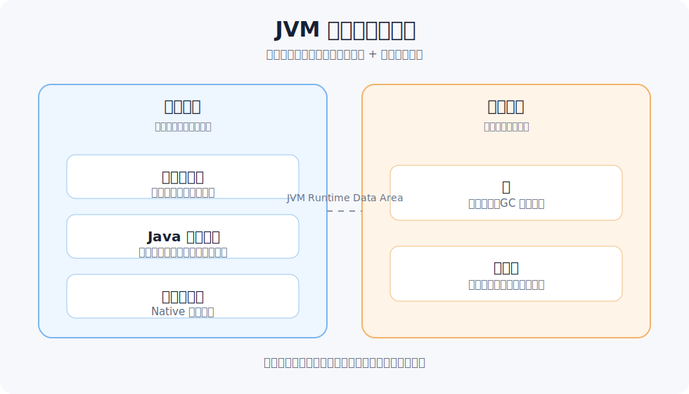
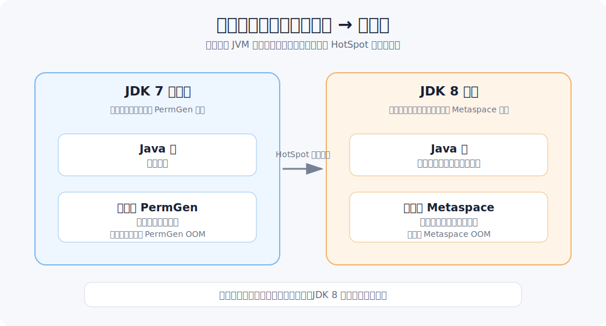
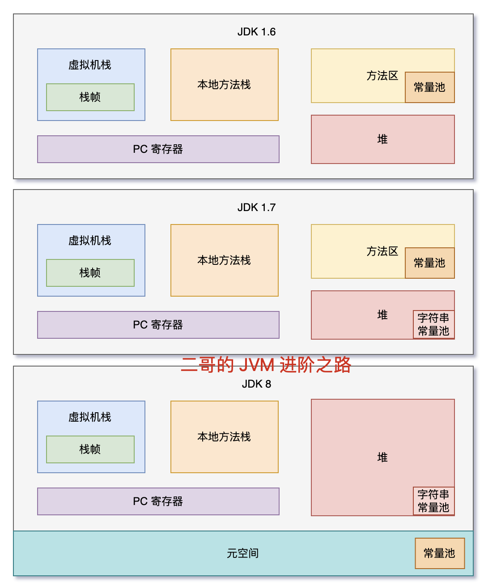

# JVM 高频面试题

## JVM 内存区域有哪些

### 一句话秒答

JVM 运行时内存主要包括程序计数器、Java 虚拟机栈、本地方法栈、堆、方法区。线程私有的是程序计数器、虚拟机栈、本地方法栈；线程共享的是堆和方法区。



### 3 句展开

堆主要存对象实例，是 GC 管理重点。虚拟机栈保存方法调用栈帧，包括局部变量表、操作数栈等。方法区存类元信息、常量、静态变量等，JDK 8 后常说元空间。

### 经典案例（代码）

```java
User user = new User(); // user 引用在栈中，对象实例在堆中
```

### 高频坑

- 堆和方法区是线程共享的。
- 栈不是只存基本类型，也存对象引用。
- 元空间使用本地内存，不等于堆。

### 面试追问

- 程序计数器为什么是线程私有？  
  因为每个线程都要记录自己下一条要执行的字节码位置。
- 哪些区域可能发生 OOM？  
  堆、方法区/元空间、直接内存等都可能。

## 堆和栈区别

### 一句话秒答

堆主要存对象实例，线程共享，需要 GC 管理；栈主要存方法调用和局部变量，线程私有，方法结束后栈帧出栈。

### 3 句展开

堆空间大但回收复杂。栈空间小但分配释放快。对象本身通常在堆里，局部变量里保存的是对象引用。

### 经典案例（代码）

```java
void test() {
    int a = 1; // 局部变量在栈帧中
    Object obj = new Object(); // 对象在堆中，obj 引用在栈帧中
}
```

### 高频坑

- 不要简单说“基本类型在栈，对象在堆”，成员变量要看对象位置。
- 栈溢出通常是递归过深。
- 堆溢出通常是对象太多且无法回收。

### 面试追问

- `StackOverflowError` 常见原因是什么？  
  方法调用层级太深，比如无限递归。
- `OutOfMemoryError` 常见原因是什么？  
  堆中对象持续增长且无法被 GC 回收。

## 方法区 / 元空间是什么

### 一句话秒答

方法区是 JVM 规范里的逻辑区域，用来存类元信息、常量、静态变量等；元空间是 HotSpot 在 JDK 8 之后对方法区的实现，使用本地内存。

### 3 句展开

JDK 7 以前常说永久代。JDK 8 后永久代被移除，类元信息主要放到元空间。元空间不在 Java 堆里，但也可能 OOM。



### JDK 7 / JDK 8 对比

| 对比点 | JDK 7 及以前 | JDK 8 以后 |
| --- | --- | --- |
| 方法区实现 | 永久代 PermGen | 元空间 Metaspace |
| 内存位置 | JVM 管理的内存区域 | 本地内存 |
| 类元信息 | 主要在永久代 | 主要在元空间 |
| 字符串常量池 | JDK 7 起逐步移到堆 | 在堆中 |
| 常见 OOM | `PermGen space` | `Metaspace` |

### 经典案例（代码）

```java
class User {
    static int count = 0; // 静态字段相关信息属于类级别
}
```

### 高频坑

- 方法区是规范，永久代/元空间是实现。
- 元空间不等于堆。
- 动态生成大量类可能导致元空间 OOM。

### 面试追问

- 为什么移除永久代？  
  永久代大小不好控制，容易 OOM，元空间使用本地内存更灵活。
- 字符串常量池一直在方法区吗？  
  不是，JDK 7 后字符串常量池移到了堆中。

## 字符串常量池和常量池区别

### 一句话秒答

常量池不是一个单一概念，面试里至少要区分 Class 文件常量池、运行时常量池和字符串常量池。简单说：Class 文件常量池在 `.class` 文件里，运行时常量池是类加载后进入方法区/元空间的运行时结构，字符串常量池专门存字符串字面量和 `intern()` 后的字符串引用。



### 3 句展开

Class 文件常量池属于 class 文件内容，保存字面量和符号引用，比如类名、方法名、字段名。类加载后，这些信息会进入运行时常量池，成为方法区的一部分；JDK 8 后方法区由元空间实现。字符串常量池的位置发生过变化：JDK 1.6 在永久代中，JDK 1.7 起移到堆中，JDK 1.8 仍在堆中，而类元信息进入元空间。

### 核心区别

| 名称 | 位置 / 阶段 | 主要内容 | 重点 |
| --- | --- | --- | --- |
| Class 文件常量池 | `.class` 文件中 | 字面量、符号引用 | 编译后的静态信息 |
| 运行时常量池 | 类加载后，方法区/元空间相关 | Class 常量池加载后的运行时表示 | 属于方法区逻辑概念 |
| 字符串常量池 | JDK 1.6 在永久代，JDK 1.7+ 在堆 | 字符串字面量、`intern()` 结果 | 专门服务字符串复用 |

### 经典案例（代码）

```java
String a = "abc";
String b = "abc";
System.out.println(a == b); // true，来自字符串常量池

String c = new String("abc");
System.out.println(a == c); // false，c 是堆中新对象
System.out.println(a == c.intern()); // true，intern 返回常量池引用
```

### 高频坑

- 不要把 Class 文件常量池、运行时常量池、字符串常量池混成一个概念。
- JDK 8 以后不是“方法区没了”，而是 HotSpot 移除了永久代，用元空间实现方法区。
- 字符串常量池在 JDK 1.7 之后移到了堆中，不再放在永久代。
- `new String("abc")` 返回的是堆里的新对象，不是字符串常量池里的对象。

### 面试追问

- 为什么 JDK 1.7 要把字符串常量池移到堆里？  
  因为字符串对象数量可能很多，放到堆里更方便 GC 管理，也减少永久代 OOM 风险。
- `intern()` 做了什么？  
  它会尝试把字符串放入字符串常量池，并返回常量池中的引用。

## 对象创建过程

### 一句话秒答

对象创建大致经历类加载检查、分配内存、初始化零值、设置对象头、执行构造方法。简单说，先分配空间，再完成对象初始化。

### 3 句展开

遇到 `new` 时，JVM 先检查类是否已加载。然后在堆中为对象分配内存，并把字段设为默认零值。最后执行构造方法，把对象初始化成程序期望的状态。

### 经典案例（代码）

```java
User user = new User("Tom");
```

### 高频坑

- 构造方法执行前，对象内存已经分配。
- 成员变量会先有默认值，再执行显式赋值和构造逻辑。
- 父类构造逻辑先于子类构造逻辑。

### 面试追问

- 对象一定分配在堆上吗？  
  逻辑上是，但 JIT 逃逸分析可能做栈上分配或标量替换优化。
- 对象头里有什么？  
  包括哈希、锁状态、GC 年龄、类型指针等信息。

## 对象什么时候进入老年代

### 一句话秒答

对象通常在新生代创建，多次 Minor GC 后仍然存活，年龄达到阈值就可能晋升到老年代。大对象也可能直接进入老年代。

### 3 句展开

新生代适合存活时间短的对象。每经过一次 Minor GC 仍存活，对象年龄会增加。老年代存放生命周期较长或较大的对象。

### 经典案例（代码）

```java
static List<byte[]> holder = new ArrayList<>();
holder.add(new byte[10 * 1024 * 1024]); // 大对象或长期引用更容易进入老年代
```

### 高频坑

- 晋升不只看年龄，还可能受空间分配担保影响。
- 大对象可能直接进入老年代。
- 老年代满了会触发更重的 GC。

### 面试追问

- Minor GC 是什么？  
  主要针对新生代的垃圾回收。
- Full GC 为什么更危险？  
  通常停顿更长，对应用影响更大。

## GC Roots 有哪些

### 一句话秒答

GC Roots 是可达性分析的起点，常见包括虚拟机栈中的引用、静态变量引用、常量引用、本地方法栈 JNI 引用等。

### 3 句展开

JVM 判断对象是否可回收，不是简单引用计数，而是从 GC Roots 出发看对象是否可达。可达对象不能回收，不可达对象才可能被回收。静态变量持有对象时，对象通常不会被回收。

### 经典案例（代码）

```java
class Holder {
    static Object obj = new Object(); // 静态引用可作为 GC Roots 链路的一部分
}
```

### 高频坑

- 循环引用不一定导致内存泄漏，可达性分析能处理。
- 静态集合长期持有对象容易造成内存泄漏。
- 局部变量引用在方法结束后通常会随栈帧销毁。

### 面试追问

- Java 为什么不用简单引用计数？  
  因为引用计数难以处理循环引用。
- 什么是可达性分析？  
  从 GC Roots 出发，能走到的对象视为存活。

## 强引用、软引用、弱引用、虚引用区别

### 一句话秒答

强引用最常见，只要还可达就不回收；软引用内存不足时回收；弱引用下一次 GC 就可能回收；虚引用不能取得对象，主要用于跟踪回收通知。

### 3 句展开

普通 `new` 出来的对象赋给变量就是强引用。软引用可用于缓存，但现在实际缓存更常用成熟框架。弱引用常见于 ThreadLocalMap 的 key。

### 经典案例（代码）

```java
WeakReference<Object> ref = new WeakReference<>(new Object());
System.gc();
System.out.println(ref.get()); // 可能为 null
```

### 高频坑

- 软引用不是永远不回收。
- 弱引用对象只要发生 GC 就可能被回收。
- 虚引用必须配合引用队列使用。

### 面试追问

- ThreadLocal 为什么可能内存泄漏？  
  key 是弱引用，但 value 是强引用，线程长期存活时 value 可能残留。
- 缓存适合软引用吗？  
  可以了解，但生产更常用明确淘汰策略的缓存框架。

## 类加载过程

### 一句话秒答

类加载机制就是 JVM 把 `.class` 字节码加载到内存，并完成校验、准备、解析、初始化，最终形成可被程序使用的 Class 对象。完整过程包括加载、验证、准备、解析、初始化；其中验证、准备、解析统称连接阶段。

### 3 句展开

加载阶段会通过类加载器读取 class 字节码，并在内存中生成 Class 对象。验证保证字节码安全，准备给静态变量分配内存并设置默认值，解析把符号引用转成直接引用。初始化阶段才真正执行静态变量显式赋值和静态代码块。

### 经典案例（代码）

```java
class Demo {
    static int value = 10; // 准备阶段先是 0，初始化阶段变 10

    static {
        value = 20; // 初始化阶段执行
    }
}
```

### 类加载阶段

| 阶段 | 作用 | 面试重点 |
| --- | --- | --- |
| 加载 | 读取 class 字节码，生成 Class 对象 | 类加载器参与 |
| 验证 | 校验字节码是否合法、安全 | 防止非法字节码破坏 JVM |
| 准备 | 给静态变量分配内存并赋默认值 | `static int a = 10` 此时先是 0 |
| 解析 | 符号引用转直接引用 | 类、方法、字段引用解析 |
| 初始化 | 执行静态变量赋值和静态代码块 | 真正执行程序写的静态初始化逻辑 |

### 主动使用触发初始化

```java
new Demo();          // 创建对象
Demo.value;          // 访问静态变量
Demo.staticMethod(); // 调用静态方法
Class.forName("Demo"); // 反射加载并初始化
```

### 高频坑

- 准备阶段不是赋程序写的值，而是默认零值。
- 初始化阶段才执行静态代码块。
- 类加载不一定立刻初始化。
- `new` 对象前，如果类还没初始化，会先触发类初始化。
- 访问 `static final` 编译期常量，不一定触发类初始化。

### 面试追问

- 类什么时候初始化？  
  首次主动使用时，比如 new、访问静态变量、调用静态方法。
- 加载和初始化是一回事吗？  
  不是，初始化是类加载流程后段的一个阶段。
- 类加载器有哪些？  
  常见有启动类加载器、扩展/平台类加载器、应用类加载器和自定义类加载器。
- 类加载机制为什么需要双亲委派？  
  为了保证核心类优先由上层加载器加载，避免重复加载和核心类被篡改。

## 双亲委派模型

### 一句话秒答

双亲委派是类加载器收到加载请求后，先交给父加载器尝试加载，父加载器加载不了，子加载器才自己加载。它能避免核心类被重复或恶意替换。

### 3 句展开

常见类加载器包括启动类加载器、扩展/平台类加载器、应用类加载器。向上委派保证 Java 核心类优先由上层加载器加载。父加载器不是继承关系里的父类，而是加载器层级关系。

### 经典案例（代码）

```java
// 自定义 java.lang.String 通常不会生效
// 核心类会优先由启动类加载器加载
```

### 高频坑

- 双亲委派的“父”不是 Java 继承意义上的父类。
- 不是所有场景都严格遵守双亲委派，例如 SPI、热部署可能打破它。
- 它主要保护核心类库安全和类唯一性。

### 面试追问

- 为什么不能随便替换 `java.lang.String`？  
  因为核心类会优先由启动类加载器加载。
- 什么场景会打破双亲委派？  
  SPI、Tomcat 类隔离、热部署等场景可能自定义加载策略。
