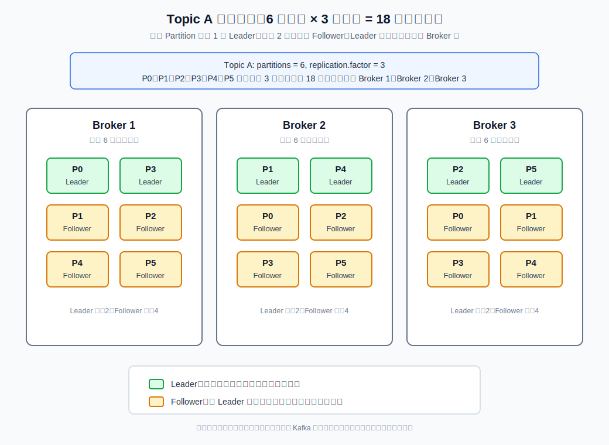
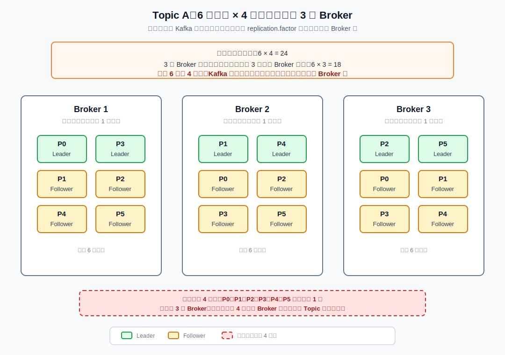
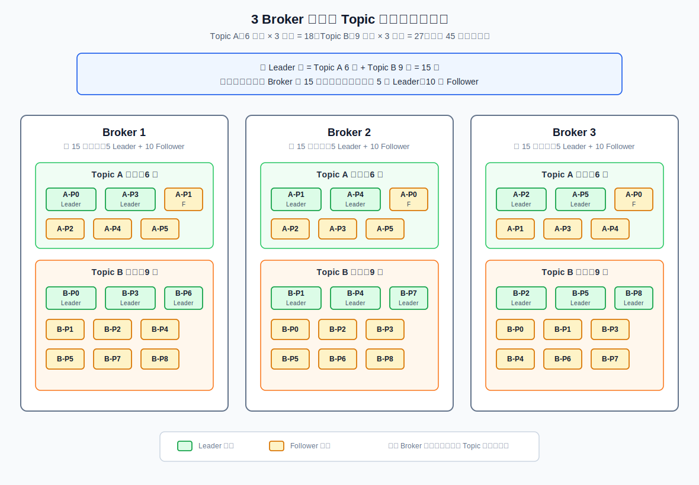
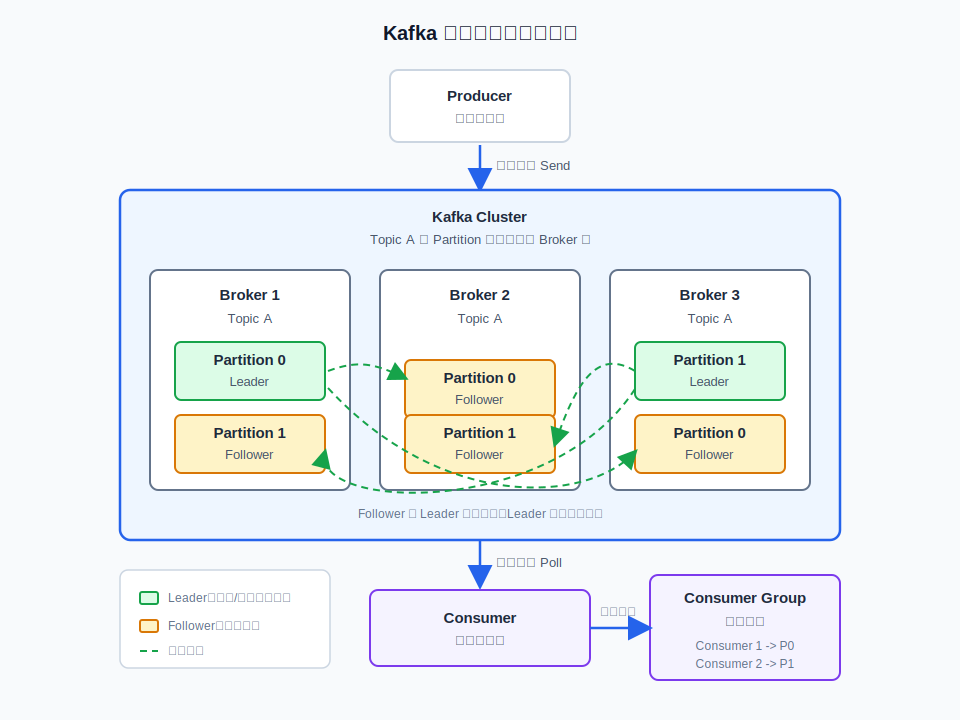

# Kafka 全面讲解

## 消息中间件
消息中间件是基于队列与消息传递技术，在网络环境中为应用系统提供**同步或异步、可靠的消息传输**的支撑性软件系统。

消息中间件利用高效可靠的消息传递机制进行平台无关的数据交流，并基于数据通信来进行分布式系统的集成。通过提供消息传递和消息排队模型，它可以在分布式环境下扩展进程间的通信

## 1. Kafka 是什么

Kafka 是一个高吞吐、可持久化、分布式的消息系统，常用于削峰填谷、异步解耦、日志采集、实时计算和事件驱动架构。

一句话理解：

```text
Kafka 把消息按主题写入分区日志，消费者按偏移量顺序读取，集群通过副本保证高可用。
```

Kafka 的核心特点：

- 高吞吐：顺序写磁盘、零拷贝、批量发送。
- 可持久化：消息落盘保存，可以按时间或大小清理。
- 可扩展：通过 Topic 分区分散读写压力。
- 高可用：通过副本、Leader 选举和 ISR 保证容错。
- 消费灵活：消费者用 offset 控制读取位置，可以重复消费或从指定位置消费。

常见使用场景：

- 订单、支付、库存等业务系统异步解耦。
- 秒杀、活动流量削峰。
- 日志、埋点、监控数据采集。
- Flink、Spark Streaming 等实时计算的数据入口。
- 数据同步、事件通知、CDC 变更数据分发。

---

## 2. Kafka 核心概念

### 2.1 Broker

Broker 是 Kafka 集群中的一台服务节点。一个 Kafka 集群由多个 Broker 组成，每个 Broker 负责保存部分分区数据并处理客户端请求。

### 2.2 Topic

Topic 是消息的逻辑分类，例如：

```text
order-create
payment-success
user-login-log
```

生产者向 Topic 写消息，消费者从 Topic 读消息。

### 2.3 Partition

Partition 是 Topic 的物理分片。一个 Topic 可以有多个分区，每个分区本质上是一个有序、追加写的日志文件。

分区的作用：

- 提升吞吐：多个分区可以分布在不同 Broker 上并行读写。
- 支持水平扩展：增加 Broker 和分区可以提升整体处理能力。
- 保证局部顺序：Kafka 只保证同一个分区内消息有序，不保证整个 Topic 全局有序。

### 2.4 Replica

Replica 是分区副本。一个分区可以有多个副本，副本分布在不同 Broker 上。

副本角色：

- Leader：处理生产者写入和消费者读取。
- Follower：从 Leader 拉取数据，保持同步。

如果 Leader 所在 Broker 宕机，Kafka 会从符合条件的 Follower 中选出新的 Leader。

例如 `Topic A` 有 6 个分区、3 个副本时，总共会有 18 个分区副本分布在 Broker 上：



如果只有 3 个 Broker，却想创建 6 个分区、4 个副本，这在 Kafka 中正常是不允许的。因为同一个分区的多个副本不能放在同一个 Broker 上，4 副本至少需要 4 个 Broker：



如果同一个集群里还有 `Topic B`，例如 `Topic A` 是 6 分区 3 副本，`Topic B` 是 9 分区 3 副本，那么 Broker 上保存的是多个 Topic 的分区副本总和：



### 2.5 Offset

Offset 是消息在分区内的位置编号，从 0 开始递增。消费者通过 offset 记录自己消费到了哪里。

需要注意：

- offset 只在分区内有意义。
- 不同消费者组的 offset 相互独立。
- offset 默认保存在 Kafka 内部 Topic：`__consumer_offsets`。

### 2.6 Consumer Group

消费者组是一组共同消费同一个 Topic 的消费者。

规则：

- 同一个消费者组内，一个分区同一时刻只能被一个消费者消费。
- 不同消费者组之间互不影响，可以各自完整消费同一份数据。
- 如果消费者数量大于分区数量，多出来的消费者会空闲。

示例：

```text
Topic 有 3 个分区
Consumer Group 有 2 个消费者

C1 -> P0、P1
C2 -> P2
```

---

## 3. Kafka 集群结构

典型 Kafka 集群结构：



```text
Producer
   |
   v
+-----------------------------+
|          Kafka Cluster       |
|                             |
|  Broker 1   Broker 2   Broker 3
|    P0-L       P1-L       P2-L
|    P1-F       P2-F       P0-F
+-----------------------------+
   |
   v
Consumer Group
```

说明：

- Producer 根据分区策略把消息写入某个分区的 Leader。
- Broker 保存分区数据和副本数据。
- Follower 从 Leader 同步数据。
- Consumer 从分区 Leader 读取消息。
- Controller 负责 Broker 上下线、分区 Leader 选举等集群管理工作。

## Kafka 基本概念
- Producer ：生产者，负责将消息发送到 Broker
- Consumer ：消费者，从 Broker 接收消息
- Consumer Group ：消费者组，由多个 Consumer 组成。消费者组内每个消费者负责消费不同分区的数据，一个分区只能由一个组内消费者消费；消费者组之间互不影响。所有的消费者都属于某个消费者组，即消费者组是逻辑上的一个订阅者。
- Broker ：可以看做一个独立的 Kafka 服务节点或 Kafka 服务实例。如果一台服务器上只部署了一个 Kafka 实例，那么我们也可以将 Broker 看做一台 Kafka 服务器。
- Topic ：一个逻辑上的概念，包含很多 Partition，同一个 Topic 下的 Partiton 的消息内容是不相同的。
- Partition ：为了实现扩展性，一个非常大的 topic 可以分布到多个 broker 上，一个 topic 可以分为多个 partition，每个 partition 是一个有序的队列。
- Replica ：副本，同一分区的不同副本保存的是相同的消息，为保证集群中的某个节点发生故障时，该节点上的 partition 数据不丢失，且 kafka 仍然能够继续工作，kafka 提供了副本机制，一个 topic 的每个分区都有若干个副本，一个 leader 和若干个 follower。
- Leader ：每个分区的多个副本中的"主副本"，生产者以及消费者只与 Leader 交互。
- Follower ：每个分区的多个副本中的"从副本"，负责实时从 Leader 中同步数据，保持和 Leader 数据的同步。Leader 发生故障时，从 Follower 副本中重新选举新的 Leader 副本对外提供服务。

### 3.1 ZooKeeper 模式和 KRaft 模式

Kafka 早期依赖 ZooKeeper 保存元数据和做集群协调。新版本 Kafka 推荐使用 KRaft 模式，由 Kafka 自己管理元数据。

| 对比项 | ZooKeeper 模式 | KRaft 模式 |
|---|---|---|
| 元数据管理 | 依赖 ZooKeeper | Kafka 自身管理 |
| 部署复杂度 | 较高 | 较低 |
| 新版本趋势 | 逐步淘汰 | 推荐使用 |
| 适合场景 | 老集群兼容 | 新集群优先选择 |

新项目建议优先使用 KRaft 模式。

---

## 4. 单机部署

下面以 Kafka 3.x KRaft 模式为例。

### 4.1 环境要求

- JDK 17 或与当前 Kafka 版本兼容的 JDK。
- Linux 服务器或本地开发环境。
- 生产环境建议单独挂载数据盘。

查看 Java 版本：

```bash
java -version
```

### 4.2 下载 Kafka

```bash
wget https://downloads.apache.org/kafka/3.8.0/kafka_2.13-3.8.0.tgz
tar -zxvf kafka_2.13-3.8.0.tgz
cd kafka_2.13-3.8.0
```

实际使用时以 Apache Kafka 官网最新稳定版本为准。

### 4.3 配置单机 KRaft

编辑配置文件：

```bash
vim config/kraft/server.properties
```

重点配置：

```properties
process.roles=broker,controller
node.id=1
controller.quorum.voters=1@localhost:9093

listeners=PLAINTEXT://:9092,CONTROLLER://:9093
advertised.listeners=PLAINTEXT://localhost:9092
controller.listener.names=CONTROLLER

log.dirs=/data/kafka-logs
num.partitions=3
```

关键说明：

- `process.roles`：当前节点角色，单机可以同时是 broker 和 controller。
- `node.id`：节点唯一 ID。
- `controller.quorum.voters`：Controller 投票节点列表。
- `listeners`：服务监听地址。
- `advertised.listeners`：客户端实际访问地址，生产环境不能随便写 `localhost`。
- `log.dirs`：Kafka 数据目录。
- `num.partitions`：默认分区数量。

### 4.4 初始化元数据

生成集群 ID：

```bash
KAFKA_CLUSTER_ID="$(bin/kafka-storage.sh random-uuid)"
```

格式化存储目录：

```bash
bin/kafka-storage.sh format -t "$KAFKA_CLUSTER_ID" -c config/kraft/server.properties
```

### 4.5 启动 Kafka

```bash
bin/kafka-server-start.sh -daemon config/kraft/server.properties
```

查看进程：

```bash
jps
```

停止 Kafka：

```bash
bin/kafka-server-stop.sh
```

---

## 5. 集群部署

生产环境通常至少 3 个节点，示例：

```text
192.168.1.101  node.id=1
192.168.1.102  node.id=2
192.168.1.103  node.id=3
```

### 5.1 Broker 1 配置

```properties
process.roles=broker,controller
node.id=1
controller.quorum.voters=1@192.168.1.101:9093,2@192.168.1.102:9093,3@192.168.1.103:9093

listeners=PLAINTEXT://:9092,CONTROLLER://:9093
advertised.listeners=PLAINTEXT://192.168.1.101:9092
controller.listener.names=CONTROLLER

log.dirs=/data/kafka-logs
num.partitions=6
default.replication.factor=3
min.insync.replicas=2
```

### 5.2 Broker 2 配置

```properties
process.roles=broker,controller
node.id=2
controller.quorum.voters=1@192.168.1.101:9093,2@192.168.1.102:9093,3@192.168.1.103:9093

listeners=PLAINTEXT://:9092,CONTROLLER://:9093
advertised.listeners=PLAINTEXT://192.168.1.102:9092
controller.listener.names=CONTROLLER

log.dirs=/data/kafka-logs
num.partitions=6
default.replication.factor=3
min.insync.replicas=2
```

### 5.3 Broker 3 配置

```properties
process.roles=broker,controller
node.id=3
controller.quorum.voters=1@192.168.1.101:9093,2@192.168.1.102:9093,3@192.168.1.103:9093

listeners=PLAINTEXT://:9092,CONTROLLER://:9093
advertised.listeners=PLAINTEXT://192.168.1.103:9092
controller.listener.names=CONTROLLER

log.dirs=/data/kafka-logs
num.partitions=6
default.replication.factor=3
min.insync.replicas=2
```

### 5.4 初始化集群

三台机器必须使用同一个集群 ID。

在任意一台机器生成：

```bash
KAFKA_CLUSTER_ID="$(bin/kafka-storage.sh random-uuid)"
echo "$KAFKA_CLUSTER_ID"
```

然后在每台机器执行：

```bash
bin/kafka-storage.sh format -t "$KAFKA_CLUSTER_ID" -c config/kraft/server.properties
```

### 5.5 启动集群

每台机器执行：

```bash
bin/kafka-server-start.sh -daemon config/kraft/server.properties
```

查看集群 API 版本：

```bash
bin/kafka-broker-api-versions.sh --bootstrap-server 192.168.1.101:9092
```

### 5.6 Docker 单机部署

开发、测试环境可以直接使用 Docker Compose 启动单节点 Kafka。下面示例使用 KRaft 模式，不依赖 ZooKeeper。

新建 `docker-compose.yml`：

```yaml
services:
  kafka:
    image: confluentinc/cp-kafka:7.7.0
    container_name: kafka
    ports:
      - "9092:9092"
    environment:
      CLUSTER_ID: "MkU3OEVBNTcwNTJENDM2Qk"
      KAFKA_NODE_ID: 1
      KAFKA_PROCESS_ROLES: "broker,controller"
      KAFKA_CONTROLLER_QUORUM_VOTERS: "1@kafka:29093"
      KAFKA_LISTENERS: "PLAINTEXT://kafka:29092,CONTROLLER://kafka:29093,PLAINTEXT_HOST://0.0.0.0:9092"
      KAFKA_ADVERTISED_LISTENERS: "PLAINTEXT://kafka:29092,PLAINTEXT_HOST://localhost:9092"
      KAFKA_LISTENER_SECURITY_PROTOCOL_MAP: "PLAINTEXT:PLAINTEXT,PLAINTEXT_HOST:PLAINTEXT,CONTROLLER:PLAINTEXT"
      KAFKA_INTER_BROKER_LISTENER_NAME: "PLAINTEXT"
      KAFKA_CONTROLLER_LISTENER_NAMES: "CONTROLLER"
      KAFKA_OFFSETS_TOPIC_REPLICATION_FACTOR: 1
      KAFKA_TRANSACTION_STATE_LOG_REPLICATION_FACTOR: 1
      KAFKA_TRANSACTION_STATE_LOG_MIN_ISR: 1
      KAFKA_GROUP_INITIAL_REBALANCE_DELAY_MS: 0
      KAFKA_AUTO_CREATE_TOPICS_ENABLE: "false"
      KAFKA_NUM_PARTITIONS: 3
    volumes:
      - kafka-data:/var/lib/kafka/data

volumes:
  kafka-data:
```

启动：

```bash
docker compose up -d
```

查看日志：

```bash
docker logs -f kafka
```

创建 Topic：

```bash
docker exec -it kafka kafka-topics \
  --bootstrap-server kafka:29092 \
  --create \
  --topic order-create \
  --partitions 3 \
  --replication-factor 1
```

查看 Topic：

```bash
docker exec -it kafka kafka-topics \
  --bootstrap-server kafka:29092 \
  --describe \
  --topic order-create
```

生产消息：

```bash
docker exec -it kafka kafka-console-producer \
  --bootstrap-server kafka:29092 \
  --topic order-create
```

消费消息：

```bash
docker exec -it kafka kafka-console-consumer \
  --bootstrap-server kafka:29092 \
  --topic order-create \
  --from-beginning
```

宿主机 Java 程序连接地址：

```properties
bootstrap.servers=localhost:9092
```

如果 Docker 部署在远程服务器上，需要把 `KAFKA_ADVERTISED_LISTENERS` 里的 `localhost` 改成服务器 IP：

```yaml
KAFKA_ADVERTISED_LISTENERS: "PLAINTEXT://kafka:29092,PLAINTEXT_HOST://192.168.1.101:9092"
```

否则客户端可能能连上 `9092`，但拿到 Broker 元数据后又去连接 `localhost`，最终访问失败。

### 5.7 Docker 三节点集群部署

下面是单台机器上用 Docker Compose 模拟 3 个 Broker 的 KRaft 集群。生产环境可以改成三台机器部署，但要把 `advertised.listeners` 改成每台机器真实 IP。

新建 `docker-compose.yml`：

```yaml
services:
  kafka1:
    image: confluentinc/cp-kafka:7.7.0
    container_name: kafka1
    ports:
      - "19092:19092"
    environment:
      CLUSTER_ID: "MkU3OEVBNTcwNTJENDM2Qk"
      KAFKA_NODE_ID: 1
      KAFKA_PROCESS_ROLES: "broker,controller"
      KAFKA_CONTROLLER_QUORUM_VOTERS: "1@kafka1:29093,2@kafka2:29093,3@kafka3:29093"
      KAFKA_LISTENERS: "PLAINTEXT://kafka1:29092,CONTROLLER://kafka1:29093,PLAINTEXT_HOST://0.0.0.0:19092"
      KAFKA_ADVERTISED_LISTENERS: "PLAINTEXT://kafka1:29092,PLAINTEXT_HOST://localhost:19092"
      KAFKA_LISTENER_SECURITY_PROTOCOL_MAP: "PLAINTEXT:PLAINTEXT,PLAINTEXT_HOST:PLAINTEXT,CONTROLLER:PLAINTEXT"
      KAFKA_INTER_BROKER_LISTENER_NAME: "PLAINTEXT"
      KAFKA_CONTROLLER_LISTENER_NAMES: "CONTROLLER"
      KAFKA_OFFSETS_TOPIC_REPLICATION_FACTOR: 3
      KAFKA_TRANSACTION_STATE_LOG_REPLICATION_FACTOR: 3
      KAFKA_TRANSACTION_STATE_LOG_MIN_ISR: 2
      KAFKA_MIN_INSYNC_REPLICAS: 2
      KAFKA_AUTO_CREATE_TOPICS_ENABLE: "false"
      KAFKA_NUM_PARTITIONS: 6
    volumes:
      - kafka1-data:/var/lib/kafka/data

  kafka2:
    image: confluentinc/cp-kafka:7.7.0
    container_name: kafka2
    ports:
      - "29092:29092"
    environment:
      CLUSTER_ID: "MkU3OEVBNTcwNTJENDM2Qk"
      KAFKA_NODE_ID: 2
      KAFKA_PROCESS_ROLES: "broker,controller"
      KAFKA_CONTROLLER_QUORUM_VOTERS: "1@kafka1:29093,2@kafka2:29093,3@kafka3:29093"
      KAFKA_LISTENERS: "PLAINTEXT://kafka2:29092,CONTROLLER://kafka2:29093,PLAINTEXT_HOST://0.0.0.0:29092"
      KAFKA_ADVERTISED_LISTENERS: "PLAINTEXT://kafka2:29092,PLAINTEXT_HOST://localhost:29092"
      KAFKA_LISTENER_SECURITY_PROTOCOL_MAP: "PLAINTEXT:PLAINTEXT,PLAINTEXT_HOST:PLAINTEXT,CONTROLLER:PLAINTEXT"
      KAFKA_INTER_BROKER_LISTENER_NAME: "PLAINTEXT"
      KAFKA_CONTROLLER_LISTENER_NAMES: "CONTROLLER"
      KAFKA_OFFSETS_TOPIC_REPLICATION_FACTOR: 3
      KAFKA_TRANSACTION_STATE_LOG_REPLICATION_FACTOR: 3
      KAFKA_TRANSACTION_STATE_LOG_MIN_ISR: 2
      KAFKA_MIN_INSYNC_REPLICAS: 2
      KAFKA_AUTO_CREATE_TOPICS_ENABLE: "false"
      KAFKA_NUM_PARTITIONS: 6
    volumes:
      - kafka2-data:/var/lib/kafka/data

  kafka3:
    image: confluentinc/cp-kafka:7.7.0
    container_name: kafka3
    ports:
      - "39092:39092"
    environment:
      CLUSTER_ID: "MkU3OEVBNTcwNTJENDM2Qk"
      KAFKA_NODE_ID: 3
      KAFKA_PROCESS_ROLES: "broker,controller"
      KAFKA_CONTROLLER_QUORUM_VOTERS: "1@kafka1:29093,2@kafka2:29093,3@kafka3:29093"
      KAFKA_LISTENERS: "PLAINTEXT://kafka3:29092,CONTROLLER://kafka3:29093,PLAINTEXT_HOST://0.0.0.0:39092"
      KAFKA_ADVERTISED_LISTENERS: "PLAINTEXT://kafka3:29092,PLAINTEXT_HOST://localhost:39092"
      KAFKA_LISTENER_SECURITY_PROTOCOL_MAP: "PLAINTEXT:PLAINTEXT,PLAINTEXT_HOST:PLAINTEXT,CONTROLLER:PLAINTEXT"
      KAFKA_INTER_BROKER_LISTENER_NAME: "PLAINTEXT"
      KAFKA_CONTROLLER_LISTENER_NAMES: "CONTROLLER"
      KAFKA_OFFSETS_TOPIC_REPLICATION_FACTOR: 3
      KAFKA_TRANSACTION_STATE_LOG_REPLICATION_FACTOR: 3
      KAFKA_TRANSACTION_STATE_LOG_MIN_ISR: 2
      KAFKA_MIN_INSYNC_REPLICAS: 2
      KAFKA_AUTO_CREATE_TOPICS_ENABLE: "false"
      KAFKA_NUM_PARTITIONS: 6
    volumes:
      - kafka3-data:/var/lib/kafka/data

volumes:
  kafka1-data:
  kafka2-data:
  kafka3-data:
```

启动集群：

```bash
docker compose up -d
```

查看容器：

```bash
docker compose ps
```

创建 3 副本 Topic：

```bash
docker exec -it kafka1 kafka-topics \
  --bootstrap-server kafka1:29092 \
  --create \
  --topic order-create \
  --partitions 6 \
  --replication-factor 3
```

查看 Topic 分区和副本：

```bash
docker exec -it kafka1 kafka-topics \
  --bootstrap-server kafka1:29092 \
  --describe \
  --topic order-create
```

正常情况下可以看到不同分区的 Leader 分布在 `1`、`2`、`3` 三个节点上，`Replicas` 有 3 个副本，`Isr` 也应该有 3 个同步副本。

宿主机 Java 程序连接地址：

```properties
bootstrap.servers=localhost:19092,localhost:29092,localhost:39092
```

如果在远程服务器部署，把三个 `PLAINTEXT_HOST` 的 advertised 地址改成服务器 IP：

```yaml
KAFKA_ADVERTISED_LISTENERS: "PLAINTEXT://kafka1:29092,PLAINTEXT_HOST://192.168.1.101:19092"
KAFKA_ADVERTISED_LISTENERS: "PLAINTEXT://kafka2:29092,PLAINTEXT_HOST://192.168.1.101:29092"
KAFKA_ADVERTISED_LISTENERS: "PLAINTEXT://kafka3:29092,PLAINTEXT_HOST://192.168.1.101:39092"
```

注意：上面三行分别放到 `kafka1`、`kafka2`、`kafka3` 的 `environment` 中，不是放在同一个服务里。

### 5.8 Docker 部署常见问题

#### 5.8.1 容器内地址和宿主机地址

Docker Kafka 通常需要两套监听地址：

- 容器内地址：容器之间访问，例如 `kafka1:29092`。
- 宿主机地址：宿主机或外部 Java 程序访问，例如 `localhost:19092` 或 `192.168.1.101:19092`。

`KAFKA_LISTENERS` 表示 Kafka 监听哪些地址，`KAFKA_ADVERTISED_LISTENERS` 表示 Kafka 告诉客户端应该连接哪些地址。客户端最终连接的是 advertised 地址。

#### 5.8.2 修改 CLUSTER_ID 后启动失败

Kafka 数据目录格式化后会记录集群 ID。如果已经启动过容器并写入了 volume，再修改 `CLUSTER_ID`，可能出现集群 ID 不一致。

开发环境可以删除 volume 后重建：

```bash
docker compose down -v
docker compose up -d
```

生产环境不要随意删除 volume，否则会丢失 Kafka 数据。

#### 5.8.3 单机和集群如何选择

- 本地开发：单机 Kafka 即可，副本数设置为 1。
- 测试环境：可以用单机三 Broker 模拟集群。
- 生产环境：建议至少 3 台机器，每台机器一个 Broker，重要 Topic 使用 3 副本。

---

## 6. Topic 常用命令

### 6.1 创建 Topic

```bash
bin/kafka-topics.sh \
  --bootstrap-server 192.168.1.101:9092 \
  --create \
  --topic order-create \
  --partitions 6 \
  --replication-factor 3
```

### 6.2 查看 Topic 列表

```bash
bin/kafka-topics.sh \
  --bootstrap-server 192.168.1.101:9092 \
  --list
```

### 6.3 查看 Topic 详情

```bash
bin/kafka-topics.sh \
  --bootstrap-server 192.168.1.101:9092 \
  --describe \
  --topic order-create
```

输出示例：

```text
Topic: order-create  PartitionCount: 6  ReplicationFactor: 3
Partition: 0  Leader: 1  Replicas: 1,2,3  Isr: 1,2,3
```

重点字段：

- `Leader`：当前处理读写的 Broker。
- `Replicas`：该分区的全部副本。
- `Isr`：当前和 Leader 保持同步的副本集合。

### 6.4 增加分区

```bash
bin/kafka-topics.sh \
  --bootstrap-server 192.168.1.101:9092 \
  --alter \
  --topic order-create \
  --partitions 12
```

注意：分区只能增加，不能直接减少。增加分区可能影响按 key 的顺序性和分区路由结果。

### 6.5 删除 Topic

```bash
bin/kafka-topics.sh \
  --bootstrap-server 192.168.1.101:9092 \
  --delete \
  --topic order-create
```

### 6.6 Java 代码创建 Topic

Kafka 可以通过 `AdminClient` 在代码里创建 Topic，适合服务启动时初始化测试 Topic，或在管理后台里动态创建 Topic。

Maven 依赖：

```xml
<dependency>
    <groupId>org.apache.kafka</groupId>
    <artifactId>kafka-clients</artifactId>
    <version>3.8.0</version>
</dependency>
```

创建 `order-create`，分区数为 6，副本因子为 3：

```java
import org.apache.kafka.clients.admin.AdminClient;
import org.apache.kafka.clients.admin.AdminClientConfig;
import org.apache.kafka.clients.admin.CreateTopicsResult;
import org.apache.kafka.clients.admin.NewTopic;

import java.util.Collections;
import java.util.HashMap;
import java.util.Map;
import java.util.Properties;
import java.util.concurrent.ExecutionException;

public class KafkaTopicCreateDemo {
    public static void main(String[] args) throws ExecutionException, InterruptedException {
        Properties props = new Properties();
        props.put(AdminClientConfig.BOOTSTRAP_SERVERS_CONFIG,
                "192.168.1.101:9092,192.168.1.102:9092,192.168.1.103:9092");

        try (AdminClient adminClient = AdminClient.create(props)) {
            String topicName = "order-create";
            int partitions = 6;
            short replicationFactor = 3;

            NewTopic topic = new NewTopic(topicName, partitions, replicationFactor);

            Map<String, String> configs = new HashMap<>();
            configs.put("min.insync.replicas", "2");
            configs.put("cleanup.policy", "delete");
            configs.put("retention.ms", String.valueOf(7 * 24 * 60 * 60 * 1000L));
            topic.configs(configs);

            CreateTopicsResult result = adminClient.createTopics(Collections.singletonList(topic));
            result.all().get();

            System.out.println("Topic 创建成功: " + topicName);
        }
    }
}
```

关键参数：

- `partitions`：Topic 分区数，例如 6。
- `replicationFactor`：每个分区的副本数，例如 3。
- `min.insync.replicas`：最少同步副本数，生产环境常和 `acks=all` 配合使用。
- `bootstrap.servers`：只需要填部分 Broker 地址，客户端会自动拉取集群元数据。

如果 Topic 已存在，代码会抛出 `TopicExistsException`。实际项目里通常先判断 Topic 是否存在：

```java
import org.apache.kafka.clients.admin.AdminClient;
import org.apache.kafka.clients.admin.AdminClientConfig;
import org.apache.kafka.clients.admin.NewTopic;

import java.util.Collections;
import java.util.Properties;
import java.util.Set;

public class KafkaTopicCreateIfAbsentDemo {
    public static void main(String[] args) throws Exception {
        Properties props = new Properties();
        props.put(AdminClientConfig.BOOTSTRAP_SERVERS_CONFIG, "192.168.1.101:9092");

        try (AdminClient adminClient = AdminClient.create(props)) {
            String topicName = "order-create";
            Set<String> topicNames = adminClient.listTopics().names().get();

            if (!topicNames.contains(topicName)) {
                NewTopic topic = new NewTopic(topicName, 6, (short) 3);
                adminClient.createTopics(Collections.singletonList(topic)).all().get();
                System.out.println("Topic 创建成功: " + topicName);
            } else {
                System.out.println("Topic 已存在: " + topicName);
            }
        }
    }
}
```

注意：

- 副本因子不能大于 Broker 数，例如 3 个 Broker 不能创建 4 副本 Topic。
- 生产环境不建议让普通业务服务随意创建 Topic，最好由运维脚本、管理后台或发布流程统一管理。
- 如果开启了 `auto.create.topics.enable=false`，业务发送消息前必须先创建 Topic。

---

## 7. 生产者和消费者命令

### 7.1 控制台生产者

```bash
bin/kafka-console-producer.sh \
  --bootstrap-server 192.168.1.101:9092 \
  --topic order-create
```

输入消息：

```text
order-1001
order-1002
```

### 7.2 控制台消费者

```bash
bin/kafka-console-consumer.sh \
  --bootstrap-server 192.168.1.101:9092 \
  --topic order-create \
  --from-beginning
```

指定消费者组：

```bash
bin/kafka-console-consumer.sh \
  --bootstrap-server 192.168.1.101:9092 \
  --topic order-create \
  --group order-service
```

### 7.3 查看消费者组

```bash
bin/kafka-consumer-groups.sh \
  --bootstrap-server 192.168.1.101:9092 \
  --list
```

### 7.4 查看消费进度

```bash
bin/kafka-consumer-groups.sh \
  --bootstrap-server 192.168.1.101:9092 \
  --describe \
  --group order-service
```

重点字段：

- `CURRENT-OFFSET`：消费者当前提交的 offset。
- `LOG-END-OFFSET`：分区最新 offset。
- `LAG`：堆积数量，等于 `LOG-END-OFFSET - CURRENT-OFFSET`。

---

## 8. Java 客户端使用

### 8.1 Maven 依赖

```xml
<dependency>
    <groupId>org.apache.kafka</groupId>
    <artifactId>kafka-clients</artifactId>
    <version>3.8.0</version>
</dependency>
```

如果使用 Spring Boot，通常使用：

```xml
<dependency>
    <groupId>org.springframework.kafka</groupId>
    <artifactId>spring-kafka</artifactId>
</dependency>
```

### 8.2 原生 Producer

```java
import org.apache.kafka.clients.producer.KafkaProducer;
import org.apache.kafka.clients.producer.ProducerConfig;
import org.apache.kafka.clients.producer.ProducerRecord;
import org.apache.kafka.common.serialization.StringSerializer;

import java.util.Properties;

public class KafkaProducerDemo {
    public static void main(String[] args) {
        Properties props = new Properties();
        props.put(ProducerConfig.BOOTSTRAP_SERVERS_CONFIG, "192.168.1.101:9092");
        props.put(ProducerConfig.KEY_SERIALIZER_CLASS_CONFIG, StringSerializer.class.getName());
        props.put(ProducerConfig.VALUE_SERIALIZER_CLASS_CONFIG, StringSerializer.class.getName());
        props.put(ProducerConfig.ACKS_CONFIG, "all");
        props.put(ProducerConfig.RETRIES_CONFIG, 3);
        props.put(ProducerConfig.ENABLE_IDEMPOTENCE_CONFIG, true);

        try (KafkaProducer<String, String> producer = new KafkaProducer<>(props)) {
            ProducerRecord<String, String> record =
                    new ProducerRecord<>("order-create", "order-1001", "create order");

            producer.send(record, (metadata, exception) -> {
                if (exception != null) {
                    exception.printStackTrace();
                    return;
                }
                System.out.println("topic=" + metadata.topic()
                        + ", partition=" + metadata.partition()
                        + ", offset=" + metadata.offset());
            });
        }
    }
}
```

### 8.3 原生 Consumer

```java
import org.apache.kafka.clients.consumer.ConsumerConfig;
import org.apache.kafka.clients.consumer.ConsumerRecord;
import org.apache.kafka.clients.consumer.ConsumerRecords;
import org.apache.kafka.clients.consumer.KafkaConsumer;
import org.apache.kafka.common.serialization.StringDeserializer;

import java.time.Duration;
import java.util.Collections;
import java.util.Properties;

public class KafkaConsumerDemo {
    public static void main(String[] args) {
        Properties props = new Properties();
        props.put(ConsumerConfig.BOOTSTRAP_SERVERS_CONFIG, "192.168.1.101:9092");
        props.put(ConsumerConfig.GROUP_ID_CONFIG, "order-service");
        props.put(ConsumerConfig.KEY_DESERIALIZER_CLASS_CONFIG, StringDeserializer.class.getName());
        props.put(ConsumerConfig.VALUE_DESERIALIZER_CLASS_CONFIG, StringDeserializer.class.getName());
        props.put(ConsumerConfig.ENABLE_AUTO_COMMIT_CONFIG, false);
        props.put(ConsumerConfig.AUTO_OFFSET_RESET_CONFIG, "earliest");

        try (KafkaConsumer<String, String> consumer = new KafkaConsumer<>(props)) {
            consumer.subscribe(Collections.singletonList("order-create"));

            while (true) {
                ConsumerRecords<String, String> records = consumer.poll(Duration.ofSeconds(1));
                for (ConsumerRecord<String, String> record : records) {
                    System.out.println("key=" + record.key()
                            + ", value=" + record.value()
                            + ", partition=" + record.partition()
                            + ", offset=" + record.offset());
                }
                consumer.commitSync();
            }
        }
    }
}
```

### 8.4 Spring Boot Producer

```java
import org.springframework.kafka.core.KafkaTemplate;
import org.springframework.stereotype.Service;

@Service
public class OrderProducer {
    private final KafkaTemplate<String, String> kafkaTemplate;

    public OrderProducer(KafkaTemplate<String, String> kafkaTemplate) {
        this.kafkaTemplate = kafkaTemplate;
    }

    public void send(String orderId) {
        kafkaTemplate.send("order-create", orderId, "create order");
    }
}
```

### 8.5 Spring Boot Consumer

```java
import org.springframework.kafka.annotation.KafkaListener;
import org.springframework.stereotype.Component;

@Component
public class OrderConsumer {

    @KafkaListener(topics = "order-create", groupId = "order-service")
    public void listen(String message) {
        System.out.println("receive: " + message);
    }
}
```

常见配置：

```yaml
spring:
  kafka:
    bootstrap-servers: 192.168.1.101:9092,192.168.1.102:9092,192.168.1.103:9092
    producer:
      acks: all
      retries: 3
      properties:
        enable.idempotence: true
    consumer:
      group-id: order-service
      enable-auto-commit: false
      auto-offset-reset: earliest
```

---

## 9. 消息发送流程

生产者发送消息的大致流程：

```text
Producer
  -> Serializer 序列化
  -> Partitioner 选择分区
  -> RecordAccumulator 批量缓存
  -> Sender 线程发送
  -> Broker Leader 写入日志
  -> 副本同步
  -> 返回 ack
```

### 9.1 分区策略

常见分区方式：

- 指定 partition：直接写入指定分区。
- 指定 key：对 key 做 hash，相同 key 通常进入同一分区。
- 不指定 key：使用默认分区策略，尽量均衡分布。

如果业务要求同一个订单的消息有序，应使用订单 ID 作为 key：

```java
new ProducerRecord<>("order-create", orderId, message);
```

### 9.2 acks 参数

| 参数 | 含义 | 可靠性 | 性能 |
|---|---|---|---|
| `acks=0` | 不等待 Broker 响应 | 最低 | 最高 |
| `acks=1` | Leader 写入成功就返回 | 中等 | 中等 |
| `acks=all` | ISR 副本确认后返回 | 最高 | 较低 |

生产环境重要业务通常使用：

```properties
acks=all
enable.idempotence=true
min.insync.replicas=2
```

### 9.3 幂等生产者

开启幂等：

```properties
enable.idempotence=true
```

作用：

- 避免生产者重试导致同一分区内消息重复写入。
- 只能保证单个生产者会话、单个分区维度的幂等。
- 不能替代业务层幂等，消费端仍然要做去重或幂等处理。

---

## 10. 消费流程和 Rebalance

消费者消费流程：

```text
Consumer
  -> 加入 Consumer Group
  -> 分配 Topic 分区
  -> poll 拉取消息
  -> 执行业务处理
  -> 提交 offset
```

### 10.1 自动提交和手动提交

自动提交：

```properties
enable.auto.commit=true
```

优点是简单，缺点是可能出现消息丢失。比如 offset 已自动提交，但业务处理失败，重启后会从新 offset 继续消费。

手动提交：

```properties
enable.auto.commit=false
```

建议在业务处理成功后再提交 offset：

```java
consumer.commitSync();
```

### 10.2 消费线程和分区的关系

Kafka 的消费并发主要取决于 Topic 分区数。

核心规则：

```text
同一个 Consumer Group 内，一个 Partition 同一时刻只能被一个 Consumer 实例或消费线程消费。
```

所以同一个消费者组的最大有效消费并发数通常是：

```text
最大有效并发数 ≈ Topic 分区数
```

例如 `Topic A` 有 6 个分区，消费者组是 `order-service`。

如果有 6 个消费者线程：

| 分区 | 消费线程 |
|---|---|
| P0 | Consumer-1 |
| P1 | Consumer-2 |
| P2 | Consumer-3 |
| P3 | Consumer-4 |
| P4 | Consumer-5 |
| P5 | Consumer-6 |

这时 6 个线程都能工作。

如果有 10 个消费者线程：

```text
P0 -> Consumer-1
P1 -> Consumer-2
P2 -> Consumer-3
P3 -> Consumer-4
P4 -> Consumer-5
P5 -> Consumer-6

Consumer-7、Consumer-8、Consumer-9、Consumer-10 空闲
```

因为只有 6 个分区，同一个消费者组内最多只有 6 个线程真正消费。

如果只有 3 个消费者线程：

| 消费线程 | 负责分区 |
|---|---|
| Consumer-1 | P0、P3 |
| Consumer-2 | P1、P4 |
| Consumer-3 | P2、P5 |

这时每个线程可能负责多个分区。

Spring Kafka 中常用 `concurrency` 设置消费并发：

```java
@KafkaListener(
        topics = "order-create",
        groupId = "order-service",
        concurrency = "6"
)
public void listen(String message) {
    // 处理消息
}
```

如果 Topic 只有 6 个分区：

```text
concurrency=6：比较合适
concurrency=10：最多仍然只有 6 个线程真正消费，多出来的线程空闲
```

消费线程数量设计时要同时考虑：

- Topic 分区数。
- Consumer Group 内消费者实例数量。
- Spring Kafka 的 `concurrency` 配置。
- 单条消息处理耗时。
- 下游数据库、Redis、HTTP 接口的承载能力。
- 是否需要保证同一个业务 key 的顺序消费。

总结：

```text
想提高同一个消费者组的消费并发，优先看 Topic 分区数。
分区数不够，单纯增加消费者线程没有明显作用。
```

### 10.3 消费多个 Topic

同一个 `Consumer Group` 可以同时订阅多个 Topic。Kafka 会把这些 Topic 的所有分区合在一起，分配给这个消费者组里的消费者线程。

例如：

```text
order-create：6 个分区
payment-success：9 个分区
总分区数：15
```

如果有 3 个消费者服务节点，每个节点 `concurrency=5`：

```text
总消费线程 = 3 × 5 = 15
```

这 15 个线程可以刚好消费 15 个分区。

明确指定多个 Topic：

```java
import org.apache.kafka.clients.consumer.ConsumerRecord;
import org.springframework.kafka.annotation.KafkaListener;

@KafkaListener(
        topics = {"order-create", "payment-success"},
        groupId = "order-service",
        concurrency = "5"
)
public void listen(ConsumerRecord<String, String> record) {
    String topic = record.topic();
    String key = record.key();
    String value = record.value();

    if ("order-create".equals(topic)) {
        // 处理订单创建消息
    } else if ("payment-success".equals(topic)) {
        // 处理支付成功消息
    }
}
```

如果不同 Topic 的业务逻辑差异很大，也可以拆成多个监听器：

```java
@KafkaListener(
        topics = "order-create",
        groupId = "order-service",
        concurrency = "2"
)
public void listenOrder(String message) {
    // 处理订单创建
}

@KafkaListener(
        topics = "payment-success",
        groupId = "order-service",
        concurrency = "3"
)
public void listenPayment(String message) {
    // 处理支付成功
}
```

注意：如果多个监听器使用同一个 `groupId` 并订阅同一个 Topic，它们是在同一个消费者组内分摊消费，不是每个监听器都完整消费一份。

### 10.4 按规则消费 Topic

Spring Kafka 可以用 `topicPattern` 按正则订阅 Topic。

消费指定前缀的所有业务 Topic：

```java
@KafkaListener(
        topicPattern = "order-.*",
        groupId = "order-service",
        concurrency = "6"
)
public void listenOrderTopics(ConsumerRecord<String, String> record) {
    System.out.println("topic=" + record.topic());
    System.out.println("value=" + record.value());
}
```

消费所有业务 Topic：

```java
@KafkaListener(
        topicPattern = "biz-.*",
        groupId = "biz-service",
        concurrency = "6"
)
public void listenBizTopics(ConsumerRecord<String, String> record) {
    // 消费 biz- 开头的所有 Topic
}
```

不建议直接使用：

```java
topicPattern = ".*"
```

因为它可能订阅到 Kafka 内部 Topic，例如：

```text
__consumer_offsets
```

如果确实要消费所有 Topic，但排除 Kafka 内部 Topic，可以这样写：

```java
@KafkaListener(
        topicPattern = "^(?!__.*).*$",
        groupId = "all-topic-consumer",
        concurrency = "6"
)
public void listenAllTopics(ConsumerRecord<String, String> record) {
    // 消费非内部 Topic
}
```

排除某一个 Topic，例如消费所有 `biz-` 开头的 Topic，但排除 `biz-test`：

```java
@KafkaListener(
        topicPattern = "biz-(?!test$).*",
        groupId = "biz-consumer",
        concurrency = "6"
)
public void listenExcludeTest(ConsumerRecord<String, String> record) {
    // 消费 biz- 开头，但排除 biz-test
}
```

排除多个 Topic，例如排除 `order-test` 和 Kafka 内部 Topic：

```java
@KafkaListener(
        topicPattern = "^(?!order-test$)(?!__.*).*$",
        groupId = "all-topic-consumer",
        concurrency = "6"
)
public void listenExcludeSomeTopics(ConsumerRecord<String, String> record) {
    // 处理消息
}
```

简单选择：

```text
topics = {"a", "b"}        明确指定 Topic
topicPattern = "biz-.*"    按正则订阅 Topic
(?!xxx)                    负向前瞻，用来排除 Topic
```

生产环境建议给 Topic 建立统一命名规范，例如：

```text
order-create
order-paid
payment-success
log-user-login
```

然后按业务前缀订阅：

```java
topicPattern = "order-.*"
```

### 10.5 Rebalance 是什么

Rebalance 是消费者组内分区重新分配的过程。

触发场景：

- 消费者实例增加或减少。
- 消费者心跳超时。
- Topic 分区数量变化。
- 消费者订阅的 Topic 发生变化。

Rebalance 的影响：

- Rebalance 期间可能暂停消费。
- 如果 offset 提交不合理，可能出现重复消费。
- 频繁 Rebalance 会影响吞吐和稳定性。

### 10.6 减少 Rebalance 的建议

- 合理设置 `session.timeout.ms` 和 `heartbeat.interval.ms`。
- 单次 `poll` 后业务处理不要超过 `max.poll.interval.ms`。
- 避免频繁扩缩容消费者。
- 使用静态成员 ID：`group.instance.id`。
- Spring Kafka 中合理设置并发数，不要超过分区数量太多。

---

## 11. 可靠性设计

### 11.1 如何保证消息不丢

生产端：

```properties
acks=all
enable.idempotence=true
retries=3
```

Broker 端：

```properties
replication.factor=3
min.insync.replicas=2
unclean.leader.election.enable=false
```

消费端：

```properties
enable.auto.commit=false
```

业务层：

- 消费处理成功后再提交 offset。
- 数据库操作使用唯一键、状态机或幂等表。
- 失败消息进入重试队列或死信队列。

### 11.2 重复消费怎么解决

Kafka 常见语义是至少一次消费，重复消费在工程上很常见。

解决方式：

- 业务表增加唯一键，例如 `order_id`。
- 使用消息 ID 做幂等记录。
- 消费端先查处理状态，再执行业务。
- 下游接口设计成幂等接口。
- 对支付、扣库存等核心链路使用本地事务或状态机控制。

### 11.3 消息顺序怎么保证

Kafka 只保证单分区有序。

要保证同一业务维度有序：

- 生产者使用相同 key，例如 `orderId`。
- 相同 key 的消息进入同一个分区。
- 消费端单线程或按 key 串行处理。
- 不要在同一业务 key 上并发乱序处理。

代价：

- 分区内顺序会限制并发度。
- 某些热点 key 可能导致单分区压力过大。

### 11.4 事务消息

Kafka 支持事务，可以让生产消息和提交消费 offset 在一个事务中完成，常用于流式处理场景。

典型配置：

```properties
transactional.id=order-tx-1
enable.idempotence=true
```

事务可以实现 Kafka 内部的 exactly-once 语义，但不能自动保证外部数据库和 Kafka 的分布式事务一致性。业务系统更常用的方案是本地事务表、Outbox 模式或最终一致性补偿。

---

## 12. 存储结构

Kafka 分区在磁盘上是追加写日志。

示例目录：

```text
/data/kafka-logs/order-create-0/
  00000000000000000000.log
  00000000000000000000.index
  00000000000000000000.timeindex
```

文件说明：

- `.log`：保存真实消息数据。
- `.index`：offset 到物理位置的稀疏索引。
- `.timeindex`：时间戳索引。

Kafka 为什么快：

- 顺序写磁盘，减少随机 IO。
- 批量发送和批量压缩，减少网络请求。
- Page Cache 利用操作系统缓存。
- 零拷贝发送文件，减少用户态和内核态复制。
- 分区并行，提升整体吞吐。

---

## 13. 数据保留和清理

Kafka 消息不会因为被消费就删除，而是根据保留策略清理。

常见配置：

```properties
log.retention.hours=168
log.retention.bytes=1073741824
log.segment.bytes=1073741824
```

说明：

- `log.retention.hours`：消息保留时间。
- `log.retention.bytes`：分区日志保留大小。
- `log.segment.bytes`：单个日志段大小。

清理策略：

```properties
cleanup.policy=delete
```

或：

```properties
cleanup.policy=compact
```

`delete` 按时间或大小删除旧数据。`compact` 会保留每个 key 的最新值，适合配置、状态、用户最新信息等场景。

---

## 14. 性能调优

### 14.1 Producer 调优

常见参数：

```properties
batch.size=32768
linger.ms=10
compression.type=lz4
buffer.memory=67108864
acks=all
```

说明：

- `batch.size`：批次大小，适当增大可以提升吞吐。
- `linger.ms`：等待更多消息组成批次，吞吐和延迟之间取舍。
- `compression.type`：压缩算法，常用 `lz4` 或 `snappy`。
- `buffer.memory`：生产者缓冲区大小。

### 14.2 Consumer 调优

常见参数：

```properties
fetch.min.bytes=1048576
fetch.max.wait.ms=500
max.poll.records=500
max.partition.fetch.bytes=1048576
```

说明：

- `fetch.min.bytes`：一次拉取的最小数据量。
- `fetch.max.wait.ms`：Broker 最多等待多久返回数据。
- `max.poll.records`：一次 poll 返回的最大消息数。
- `max.partition.fetch.bytes`：单分区一次拉取最大数据量。

### 14.3 Broker 调优

关注点：

- 磁盘：优先使用 SSD，数据盘和系统盘分离。
- 网络：Kafka 对网络吞吐要求高，注意带宽和网卡。
- 分区数：不是越多越好，分区过多会增加文件句柄、内存和 Rebalance 成本。
- 副本数：生产常用 3 副本。
- JVM：根据机器内存设置合理堆大小，Kafka 依赖 Page Cache，不应把内存都给 JVM 堆。

---

## 15. 监控与运维

### 15.1 重点监控指标

Broker：

- Broker 存活状态。
- 磁盘使用率。
- 网络流量。
- 请求延迟。
- Under Replicated Partitions。
- Offline Partitions。

Producer：

- 发送速率。
- 发送失败率。
- 请求延迟。
- 重试次数。

Consumer：

- 消费速率。
- 消费延迟。
- Lag 堆积。
- Rebalance 次数。

### 15.2 常用排查命令

查看 Topic：

```bash
bin/kafka-topics.sh --bootstrap-server 192.168.1.101:9092 --describe
```

查看消费者组：

```bash
bin/kafka-consumer-groups.sh --bootstrap-server 192.168.1.101:9092 --list
```

查看 Lag：

```bash
bin/kafka-consumer-groups.sh \
  --bootstrap-server 192.168.1.101:9092 \
  --describe \
  --group order-service
```

### 15.3 消费堆积怎么处理

处理思路：

- 先确认是生产突增、消费变慢还是消费者异常。
- 查看消费者组 Lag 和分区分布。
- 检查下游数据库、Redis、第三方接口是否变慢。
- 增加消费者实例，但消费者数量不要超过分区数太多。
- 增加 Topic 分区，提高并行度。
- 对耗时逻辑做批处理、异步化或限流。
- 必要时临时扩容 Broker、消费者和下游资源。

---

## 16. 常见故障

### 16.1 advertised.listeners 配错

现象：

- 客户端能连上 bootstrap server，但后续访问 Broker 失败。
- 日志中出现连接 `localhost`、内网地址或不可达地址。

原因：

`advertised.listeners` 是 Kafka 告诉客户端的 Broker 地址，必须是客户端能访问的地址。

### 16.2 分区副本不同步

现象：

- `UnderReplicatedPartitions` 大于 0。
- Topic describe 中 ISR 少于 Replicas。

可能原因：

- Broker 网络抖动。
- 磁盘 IO 太慢。
- Follower 复制线程跟不上。
- Broker 负载过高。

### 16.3 消费者一直重复消费

可能原因：

- 消费成功前程序崩溃，offset 未提交。
- 手动提交位置不正确。
- 业务处理时间过长触发 Rebalance。
- 消费端抛异常后又从旧 offset 重新拉取。

解决方向：

- 处理成功后提交 offset。
- 做业务幂等。
- 调整 `max.poll.interval.ms`。
- 优化单批处理耗时。

### 16.4 消息丢失

可能原因：

- 生产者使用 `acks=0` 或 `acks=1`。
- 没有开启重试和幂等。
- `unclean.leader.election.enable=true` 导致非同步副本被选为 Leader。
- 消费端自动提交 offset 后业务失败。

---

## 17. Kafka 和其他消息队列对比

| 对比项 | Kafka | RabbitMQ | RocketMQ |
|---|---|---|---|
| 核心定位 | 高吞吐日志和事件流 | 通用消息队列 | 分布式消息中间件 |
| 吞吐能力 | 很高 | 中等 | 高 |
| 消息模型 | Topic + Partition | Exchange + Queue | Topic + Queue |
| 顺序消息 | 分区内有序 | 队列内有序 | 支持较好 |
| 延迟消息 | 原生较弱 | 插件支持 | 支持较好 |
| 事务消息 | Kafka 内部事务 | 支持有限 | 支持较好 |
| 典型场景 | 日志、埋点、实时流 | 业务解耦、路由灵活 | 电商交易、金融业务 |

简单选择：

- 大数据、日志、实时计算：优先 Kafka。
- 复杂路由、传统队列模型：考虑 RabbitMQ。
- 电商交易、延迟消息、事务消息：可以考虑 RocketMQ。

---

## 18. 面试高频问题

### 18.1 Kafka 为什么快？

一句话秒答：

Kafka 快主要因为顺序写磁盘、批量发送、Page Cache、零拷贝和分区并行。

展开：

Kafka 写入不是频繁随机写，而是追加写日志文件。生产者会批量发送消息，Broker 也能批量处理。数据读写大量依赖操作系统 Page Cache，发送文件时还能使用零拷贝减少内存复制。Topic 被拆成多个分区后，可以分布到多个 Broker 上并行读写。

### 18.2 Kafka 如何保证高可用？

一句话秒答：

Kafka 通过分区副本、Leader/Follower、ISR 和 Leader 选举保证高可用。

展开：

每个分区有多个副本，一个 Leader 负责读写，多个 Follower 复制数据。Leader 宕机后，Kafka 会优先从 ISR 中选择新的 Leader。生产环境通常使用 3 副本，并配置 `min.insync.replicas=2` 和 `acks=all`。

### 18.3 Kafka 会不会丢消息？

一句话秒答：

配置不当会丢，合理配置后可以大幅降低丢消息风险，但消费端仍要结合业务幂等和失败处理。

关键配置：

```properties
acks=all
enable.idempotence=true
retries=3
min.insync.replicas=2
unclean.leader.election.enable=false
enable.auto.commit=false
```

### 18.4 如何保证消息顺序？

一句话秒答：

Kafka 只能保证单分区有序，业务上要把需要有序的消息用同一个 key 发到同一个分区。

展开：

例如同一个订单的创建、支付、发货消息都使用 `orderId` 作为 key。这样它们会进入同一个分区，消费者按分区顺序读取。但如果消费端多线程并发处理同一 key，也可能破坏业务顺序。

### 18.5 如何处理重复消费？

一句话秒答：

重复消费无法完全避免，业务端必须做幂等。

常见方案：

- 数据库唯一键。
- 消息 ID 去重表。
- 状态机校验。
- Redis 短期去重。
- 下游接口幂等。

### 18.6 什么是 Rebalance？

一句话秒答：

Rebalance 是消费者组内分区重新分配的过程。

触发条件：

- 消费者加入。
- 消费者退出或宕机。
- 消费者心跳超时。
- Topic 分区变化。

影响：

Rebalance 期间消费者可能暂停消费，频繁 Rebalance 会导致吞吐下降和重复消费风险。

### 18.7 ISR 是什么？

一句话秒答：

ISR 是和 Leader 保持同步的副本集合。

展开：

只有跟上 Leader 复制进度的 Follower 才会在 ISR 中。Leader 宕机时，Kafka 会优先从 ISR 中选新 Leader。`min.insync.replicas` 用来控制最少同步副本数量，配合 `acks=all` 可以提高可靠性。

### 18.8 acks=all 就一定不丢消息吗？

不是。

`acks=all` 表示消息需要被 ISR 中足够副本确认后才返回成功，但还要配合：

- `min.insync.replicas`。
- `replication.factor`。
- `unclean.leader.election.enable=false`。
- 生产者重试和幂等。
- 消费端手动提交 offset。

否则仍然可能因为副本不足、错误选主或消费端提交不当导致数据问题。

### 18.9 Kafka 如何实现延迟消息？

Kafka 原生不擅长精确延迟消息。

常见方案：

- 使用多个延迟 Topic，例如 5s、1m、10m。
- 消费端判断时间，不到时间再投递到延迟队列。
- 使用时间轮组件。
- 业务对延迟消息要求强时考虑 RocketMQ。

### 18.10 Kafka 分区越多越好吗？

不是。

分区多可以提升并行度，但也会带来成本：

- 更多文件句柄。
- 更多内存占用。
- 更长的 Leader 选举时间。
- 更高的 Rebalance 成本。
- 单个 Broker 管理压力增加。

分区数量应该根据吞吐、消费者并发、Broker 数量和未来增长预估来定。

---

## 19. 生产环境建议配置

Topic：

```properties
replication.factor=3
min.insync.replicas=2
```

Broker：

```properties
unclean.leader.election.enable=false
log.retention.hours=168
auto.create.topics.enable=false
```

Producer：

```properties
acks=all
enable.idempotence=true
retries=3
compression.type=lz4
linger.ms=10
```

Consumer：

```properties
enable.auto.commit=false
auto.offset.reset=earliest
max.poll.records=500
```

运维：

- Broker 至少 3 台。
- 重要 Topic 使用 3 副本。
- 客户端配置多个 bootstrap server。
- 监控 Lag、磁盘、网络、ISR、离线分区。
- 消费端必须做幂等。
- 不要依赖 Kafka 替代数据库事务。

---

## 20. 学习路线

建议按这个顺序掌握：

1. 先理解 Topic、Partition、Broker、Consumer Group、Offset。
2. 本地部署 Kafka，创建 Topic 并用命令行生产消费。
3. 用 Java Producer 和 Consumer 写一个完整 Demo。
4. 理解副本、ISR、acks、幂等、offset 提交。
5. 学习 Rebalance、Lag、消费堆积排查。
6. 最后再看事务、Exactly Once、性能调优和源码。

Kafka 的面试重点不是背命令，而是能解释清楚：

```text
消息如何写入、如何复制、如何消费、哪里可能丢、哪里可能重复、如何在业务上兜底。
```
