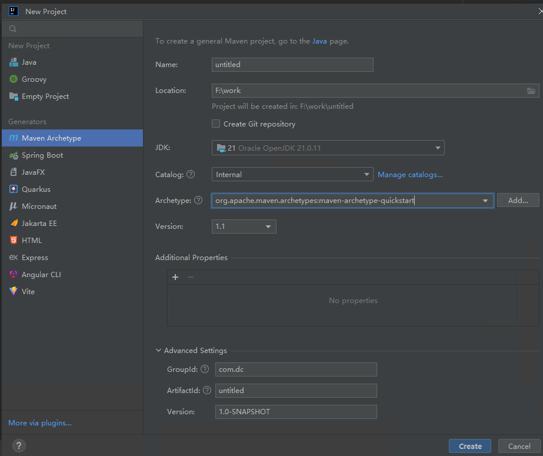

# springboot  多项目构建

## 构建maven （Maven Archetype）
    新版本idea 没有maven 选项 只有Maven Archetype 


Archetype 改成：maven-archetype-quickstart

## 修改pom
首先删除多余src

修改pom
<packaging>jar</packaging>修改成 <packaging>pom</packaging>

添加springboot版本管理 和一些插件及常用包管理 大致如下
```xml

<project xmlns="http://maven.apache.org/POM/4.0.0" xmlns:xsi="http://www.w3.org/2001/XMLSchema-instance"
         xsi:schemaLocation="http://maven.apache.org/POM/4.0.0 http://maven.apache.org/xsd/maven-4.0.0.xsd">
    <modelVersion>4.0.0</modelVersion>

    <groupId>com.dc</groupId>
    <artifactId>java_study_demo</artifactId>
    <version>1.0-SNAPSHOT</version>
    <packaging>pom</packaging>

    <name>java_study_demo</name>
    <url>http://maven.apache.org</url>

    <properties>

        <java.version>21</java.version>
        <maven.compiler.release>21</maven.compiler.release>
        <maven.compiler.parameters>true</maven.compiler.parameters>

        <project.build.sourceEncoding>UTF-8</project.build.sourceEncoding>
        <project.reporting.outputEncoding>UTF-8</project.reporting.outputEncoding>
        <!-- Spring Boot -->
        <spring-boot.version>3.5.14</spring-boot.version>
        <!-- 工具 -->
        <lombok.version>1.18.36</lombok.version>
        <hutool.version>5.8.40</hutool.version>

    </properties>

    <modules>

    </modules>

    <dependencies>

        <dependency>
            <groupId>cn.hutool</groupId>
            <artifactId>hutool-all</artifactId>
            <version>${hutool.version}</version>
        </dependency>

        <!-- Lombok -->
        <dependency>
            <groupId>org.projectlombok</groupId>
            <artifactId>lombok</artifactId>
            <version>${lombok.version}</version>
            <optional>true</optional>
        </dependency>

        <dependency>
            <groupId>com.alibaba.fastjson2</groupId>
            <artifactId>fastjson2</artifactId>
            <version>2.0.62</version>
            <scope>compile</scope>
        </dependency>
        <!-- Source: https://mvnrepository.com/artifact/org.apache.commons/commons-lang3 -->
        <dependency>
            <groupId>org.apache.commons</groupId>
            <artifactId>commons-lang3</artifactId>
            <version>3.20.0</version>
            <scope>compile</scope>
        </dependency>

        <!-- Source: https://mvnrepository.com/artifact/org.apache.commons/commons-collections4 -->
        <dependency>
            <groupId>org.apache.commons</groupId>
            <artifactId>commons-collections4</artifactId>
            <version>4.5.0</version>
            <scope>compile</scope>
        </dependency>

    </dependencies>

    <dependencyManagement>
        <dependencies>
            <!-- Spring Boot 官方依赖版本管理 -->
            <dependency>
                <groupId>org.springframework.boot</groupId>
                <artifactId>spring-boot-dependencies</artifactId>
                <version>${spring-boot.version}</version>
                <type>pom</type>
                <scope>import</scope>
            </dependency>

        </dependencies>
    </dependencyManagement>

    <build>
        <pluginManagement>
            <plugins>
                <!-- 编译插件 -->

                <!-- Spring Boot 插件（打包可执行 jar）-->
                <plugin>
                    <groupId>org.springframework.boot</groupId>
                    <artifactId>spring-boot-maven-plugin</artifactId>
                    <version>${spring-boot.version}</version>
                </plugin>
                <!-- 2. maven-jar-plugin（可选，主要给 common、api、service 等非启动模块使用） -->
                <plugin>
                    <groupId>org.apache.maven.plugins</groupId>
                    <artifactId>maven-jar-plugin</artifactId>
                    <version>3.5.1</version>
                </plugin>
            </plugins>
        </pluginManagement>

        <plugins>
            <plugin>
                <groupId>org.apache.maven.plugins</groupId>
                <artifactId>maven-compiler-plugin</artifactId>
                <version>3.11.0</version>
                <configuration>
                    <source>${java.version}</source>
                    <target>${java.version}</target>
                    <encoding>UTF-8</encoding>
                </configuration>
            </plugin>

            <plugin>
                <groupId>org.apache.maven.plugins</groupId>
                <artifactId>maven-resources-plugin</artifactId>
                <version>3.3.1</version>
            </plugin>


        </plugins>
    </build>
</project>


```

## 子项目
添加父pom 及插件

```xml
    <parent>
        <groupId>com.dc</groupId>
        <artifactId>java_study_demo</artifactId>
        <version>1.0-SNAPSHOT</version>
    </parent>

<!--只需要jar 不启动-->
<build>
<finalName>dc-commons</finalName>
<plugins>
    <plugin>
        <groupId>org.apache.maven.plugins</groupId>
        <artifactId>maven-jar-plugin</artifactId>
    </plugin>
</plugins>
</build>

<!--需要启动 大概如下-->
<build>
<finalName>dc-manage</finalName>
<plugins>
    <plugin>
        <groupId>org.springframework.boot</groupId>
        <artifactId>spring-boot-maven-plugin</artifactId>

        <configuration>
            <mainClass>com.dc.DcManageApplication</mainClass>
        </configuration>
        <executions>
            <execution>
                <id>repackage</id>
                <goals>
                    <goal>repackage</goal>
                </goals>
            </execution>
        </executions>
    </plugin>
</plugins>
</build>

```