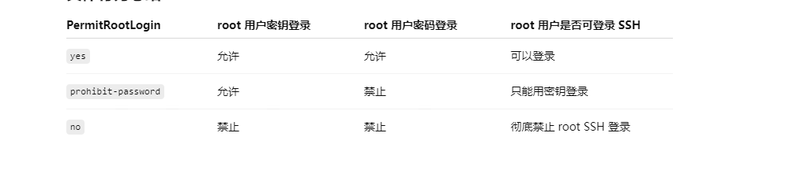

# ssh秘钥登录

```agsl
ssh-keygen -t ed25519 -C "your_email@example.com"


mkdir -p ~/.ssh

vim -p ~/.ssh/authorized_keys

··· 复制秘钥

chmod 700 ~/.ssh
chmod 600 ~/.ssh/authorized_keys


```

# ubuntu 不可以连接ssh
```angular2html
sudo systemctl status ssh
sudo apt update
sudo apt install openssh-server -y
sudo systemctl enable --now ssh

sudo apt install -y unzip zip git telnet vim net-tools wget curl vim net-tools lrzsz

```

```angular2html
每次启动都卡在 cloud-init 的 cc_final_message.py，显示 “Used fallback datasource”

Ctrl + Alt + F2

sudo rm -f /etc/cloud/cloud-init.disabled
sudo touch /etc/cloud/cloud-init.disabled

sudo mkdir -p /etc/cloud/cloud.cfg.d
echo "datasource_list: [ None ]" | sudo tee /etc/cloud/cloud.cfg.d/99-disable-cloud-init.cfg

sudo reboot

-----------或-
sudo apt purge cloud-init -y
sudo rm -rf /etc/cloud
sudo rm -rf /var/lib/cloud
sudo reboot

```


# 配置 SSH 服务禁用密码登录，只允许密钥登录

```agsl
sudo vi /etc/ssh/sshd_config

# 禁止 root 密码登录（根据需求可设置 no 或 prohibit-password）
PermitRootLogin prohibit-password

# 只允许公钥认证
PasswordAuthentication no
ChallengeResponseAuthentication no
UsePAM yes

# 确认公钥认证开启（一般默认开启）
PubkeyAuthentication yes


sudo systemctl restart sshd
```




